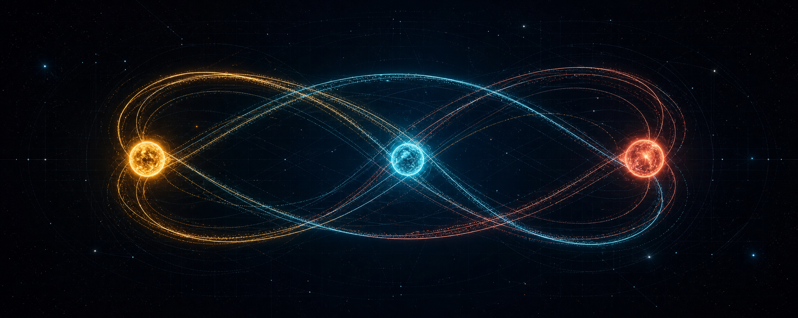
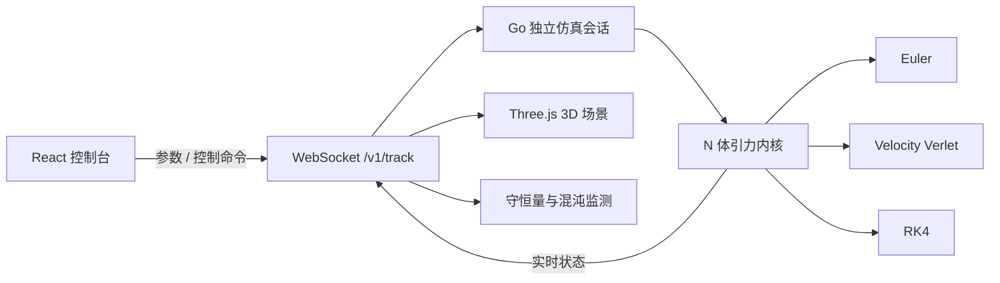

<div align="center">
  

  <h1>Three Body Problem</h1>

  <p><strong>把不可预测的宇宙，装进浏览器。</strong></p>
  <p>一个面向探索与教学的三体 / N 体引力数值仿真平台：<br />
  用 Go 计算轨道，用 WebSocket 实时传输状态，用 React + Three.js 呈现混沌。</p>

  <p>
    
    
    
    <a href="./LICENSE"></a>
  </p>

  <p>
    <a href="#-为什么值得一看">功能亮点</a> ·
    <a href="#-一分钟启动">快速开始</a> ·
    <a href="#-可复现的数值实验">数值实验</a> ·
    <a href="#-系统架构">系统架构</a>
  </p>
</div>

> 三颗天体、一条引力定律，却足以产生极其复杂的未来。这个项目让你不只“看到”轨道，还能测量误差、切换算法、回溯时间，并亲手观察微小扰动如何被混沌放大。

## ✨ 为什么值得一看

| | 能力 | 你可以做什么 |
|:---:|---|---|
| 🌌 | **实时 3D 仿真** | 在可旋转、缩放的深空场景中观察天体与轨迹，状态由后端持续推送 |
| 🧮 | **三种积分器** | 运行中切换 Euler、Velocity Verlet 与 RK4，直观看到速度、精度与稳定性的差异 |
| ♾️ | **经典轨道预设** | 一键加载 Chenciner–Montgomery 八字轨道、拉格朗日三角与随机束缚系统 |
| ⏱️ | **时间控制** | 播放、暂停、单步、`0.25x`–`4x` 倍速、重置；暂停后可拖动时间轴并从历史帧继续演化 |
| 📈 | **守恒量监测** | 实时查看总能量、相对能量漂移 `ΔE/E₀`、动量、角动量与天体间距离 |
| 🦋 | **混沌孪生对比** | 克隆当前系统并加入 `10⁻⁶` 初值扰动，同步观察两条轨迹如何指数级分离 |
| 💾 | **方案与录像** | 本地保存参数方案、导入 / 导出 JSON；录制仿真后可脱离后端离线回放 |
| 👥 | **独立多会话** | 每个 WebSocket 客户端拥有独立的仿真状态，互不干扰 |

## 🚀 一分钟启动

### 环境要求

- [Go 1.21+](https://go.dev/)
- [Node.js 18+](https://nodejs.org/)

先克隆项目：

```bash
git clone https://github.com/SuanLa/ThreeBodyProblem.git
cd ThreeBodyProblem
```

分别打开两个终端。

**终端 1：启动物理计算后端**

```bash
cd backEnd
go run .
```

**终端 2：启动可视化前端**

```bash
cd front
npm install
npm start
```

浏览器访问 **[http://localhost:3000](http://localhost:3000)**。后端默认监听 `6750` 端口。

### 推荐体验路线

1. 选择 **八字轨道**，点击播放，观察三个等质量天体沿同一条曲线追逐。
2. 打开 **守恒量面板**，比较 Verlet、RK4 与 Euler 的能量漂移。
3. 开启 **混沌对比**，观察 `10⁻⁶` 级别的初值扰动如何逐渐撕开两套轨迹。
4. 暂停并拖动时间轴，从任意历史时刻重新出发，看看未来是否仍然相同。

## 🔬 可复现的数值实验

这里不只有视觉效果。仓库内置实验程序、原始 CSV、基准测试与可浏览图表，数值结论可以复跑验证。

| 实验 | 代表性结果 | 复现方式 |
|---|---|---|
| 长期能量漂移 | 八字轨道 10 周期：Euler `≈ 2×10⁻¹`，Verlet `≈ 2.6×10⁻¹⁰`，RK4 `≈ 2.6×10⁻¹³` | `go run ./cmd/energydrift` |
| 收敛阶分析 | Euler `≈ 1`、Verlet `= 2`、RK4 `≈ 4`，与理论阶一致 | `go run ./cmd/energydrift` |
| 性能基准 | N=3 时单步约 `0.06–0.22 μs`；达到 `10⁻⁸` 误差时，高阶方法的总成本显著更低 | `go run ./cmd/perf` |
| 物理定律测试 | 两体圆轨道能量守恒、八字周期回归、动量守恒 | `go test ./...` |

完整记录见 [性能基准报告](./docs/experiments/performance.md) 与 [`docs/experiments/`](./docs/experiments/) 实验数据目录。

```bash
cd backEnd
go test ./...
go test -bench . ./utils/algorithm/
```

## 🧭 系统架构



| 层 | 技术 | 职责 |
|---|---|---|
| 可视化 | React、Three.js、react-three-fiber、drei | 3D 场景、轨迹、相机与实时交互 |
| 界面 | MUI | 参数配置、播放控制、图表与方案管理 |
| 通信 | Gorilla WebSocket | 双向控制命令与高频仿真状态推送 |
| 服务 | Gin | 路由、中间件与会话入口 |
| 计算 | Go | `O(N²)` 引力求解、积分器与守恒量计算 |
| 工程 | Viper、Zap | 配置管理与结构化日志 |

<details>
<summary><strong>查看目录结构</strong></summary>

```text
ThreeBodyProblem/
├── backEnd/
│   ├── api/ · router/ · middleware/ · service/  # Web 与会话层
│   ├── utils/algorithm/                          # 向量、系统、积分器、守恒量
│   ├── utils/ws/ · utils/protocol/               # WebSocket 与通信协议
│   └── cmd/energydrift/ · cmd/perf/              # 数值实验程序
├── front/src/
│   ├── router/                                   # 设置页与仿真展示页
│   ├── component/                                # 天体、控制器、监测面板
│   └── physics/ · presets/ · store/              # 指标、预设与本地持久化
└── docs/
    ├── assets/                                   # README 视觉素材
    └── experiments/                              # CSV、图表与性能报告
```

</details>

<details>
<summary><strong>查看 WebSocket 协议核心字段</strong></summary>

前后端通过 `ws://localhost:6750/v1/track` 交换 JSON 数据。

| 字段 | 说明 |
|---|---|
| `star` | 会话控制；`false` 表示停止 |
| `Objects` / `TwinObjects` | 主系统 / 孪生系统的天体数组，包含质量、位置与速度 |
| `G` / `Dt` / `Method` / `Softening` | 引力常数、时间步长、积分器与软化项 |
| `Cmd` | `pause`、`resume`、`step`、`speed`；留空表示按完整参数启动 |
| `SleepTime` / `StepsPerPush` | 推送间隔与每次推送前推进的计算步数 |

</details>

## 🤝 参与贡献

欢迎提交 Issue、改进数值算法、补充经典轨道预设，或优化可视化体验。提交代码前建议先运行：

```bash
cd backEnd && go test ./...
```

如果这个项目让你更直观地理解了三体问题，欢迎点亮一个 ⭐，让更多人看见它。

## 📄 License

本项目基于 [Apache License 2.0](./LICENSE) 开源。
